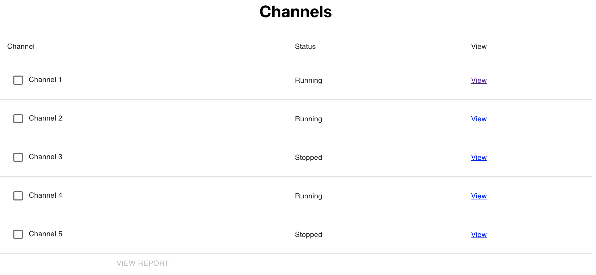

# Fullstack Take Home

A take home exercise for candidates for full stack engineering.

We aim to have this take four hours or less. If you get stuck feel free to contact us with
your questions, we work as a team and would be happy to support you during this project.

This is a fullstack app, powered by Django/Python on the backend and React on the frontend.
To get started, you'll need [python installed](https://wiki.python.org/moin/BeginnersGuide/Download). We recommend making a virtual environment to keep dependencies organized. To do that, and install requirements you can do:

```shell
python -m venv .venv
source .venv/bin/activate
pip install -r requirements.txt
```

You should then have all backend requirements installed and can generate some data and start the app by running:

```shell
python api/manage.py migrate
python api/manage.py populate
python api/manage.py runserver
```

Next, in a new terminal, you can install frontend requirements and get the app running by doing:

```shell
npm i && npm start
```

# Evaluation guidelines

Evaluation of your work we be based on the follow criteria:

- Meeting functional requirements
- Beautiful and intuitive UI
- Clarity of Code
- Performance of Solution

The picture below are wire frames, not final design. We look to you to take ownership and make this a beautiful UI. It should be clean, crisp, and easy to navigate, using colors that call attention to elements that should be prioritized.

_You may add any and all packages you would like and are encouraged to use component
libraries... but, don't copy and past code. If it looks like you don't have a grasp of the tools you're using, that will be a large mark against your solution._

# Requirements

## Story

As a battery executive I would like to see the status of my production channels and be
able to see reports on quality control metrics (pass/fail) for particular batches and channels.
A "batch" is the output of a particular channel on a particular day.

One of our engineers scaffolded out the project, but his is now on PTO and you need to finish it. He is hading if off to you to see it over the finish line and fix up the styles (he's primarily a BE dev and you can see that from the UI!)

## Detailed requirements

- Application landing page should be a table of channels with their name, status, and a link to view
  a detail report on them. The table rows should be selectable so that the user can select multiple channels
  and view a report across multiple channels. A rough design of this:
  

  - This has been completed, but is ugly, fix up the styles and make it so we don't have to scroll down to see the "View Report Button"
  - The "View Report" button should only be activated if the user has selected 1 or more channels, via
    their checkbox. When the "View Report" button is clicked the user should be taken to a bulk report
    view for the selected channels

- The "View" links witin the table should only be visible when the user is hovering over that row.

- The Bulk Report and Detail Views should be more or less identical, the only change
  being the channels that are represented in the view. The view is implemented with a table,
  and a placeholder for the charts.

  The view needs the following changes:

  - Add a header with a date range picker and an input to adjust the pass capacity.
    - When these values change the table and the charts should update to reflect it.
      (the method fetching this data is implemented already).
  - Add two histograms to the left side of the view.
    - Both histograms should have the pass rate on the y-axis
    - One histogram should have the date as the x-axis
    - One histogram should have the channel names on the x-axis
    - Put one histogram above the other so that the histograms take up the left side
      of the view and the table takes up te right
  - The table is ugly and hard to use. Make the following fixes:

    - Support sorting of the pass rate and the date(by ascending and descending for both)
    - Paginate the results so its not going off the screen

  - When doing a Bulk Report the page header should say "Bulk Report" when doing a detail view of a
    channel, the channel's name should be shown (as is in the screenshot)

  - Finally, the view should be able to be sharable, meaning if I copy the URL and send it to someone
    they will see exactly what I'm looking at, this includes the current sorting, pagination options,
    date range selected, and capacity pass

## BONUS

- This is a full stack job, but front end leaning, so everything above is on the front end.
  That being said, how about do some python and impress us? This is considered bonus, do so as you desire.
- The engineer that scaffolded out the app said the backend for the report is really bad right now.
  He said something about it doing "N Queries" and that looping to count the passes is really slow
  and naive. He linked [this method](https://github.com/SubwayLabs/Full-Stack-Take-Home/blob/main/api/channels/models.py#L17) and said if you could improve it while he's out it would be awesome. You should be able to change it to far less queries (maybe even just 1) and avoid looping over the batteries to compute the pass rate.
